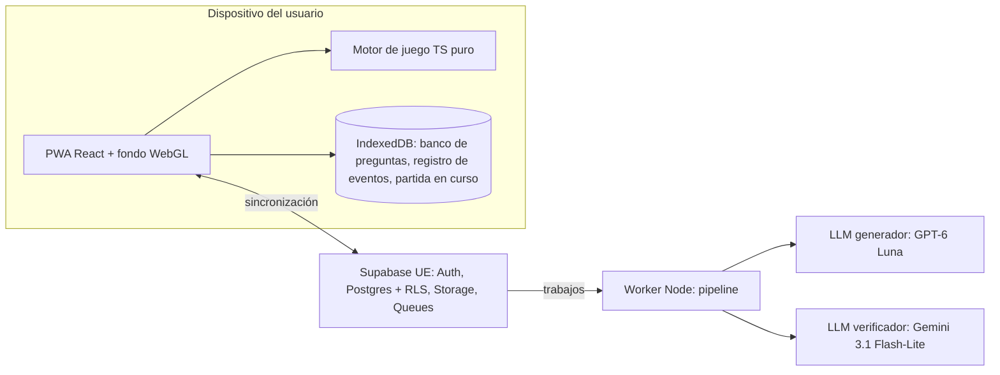
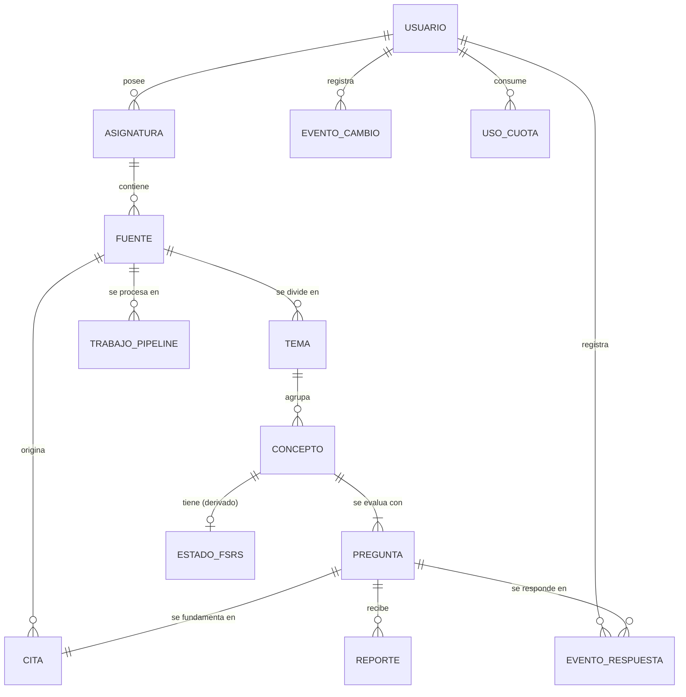

# SRS: Empollatro

<!-- markdownlint-disable MD060 -->

**Especificación de Requisitos de Software.** Estructura adaptada de ISO/IEC/IEEE 29148.

| Campo | Valor |
|---|---|
| Versión | 1.2 (borrador para aprobación) |
| Fecha | 2026-09-30 |
| Dueño | Florin Gugu |
| Estado | Decisiones de diseño resueltas salvo las de H3/H4 (§10.1). Pendiente de la aprobación final del dueño |
| Fuente de las decisiones | Entrevista de diseño del 2026-09-29/30 (Q1–Q41), recogida en el [Apéndice A](#apéndice-a-registro-de-decisiones-y-trazabilidad) |

---

## 1. Introducción

### 1.1 Propósito

Este documento es la referencia obligatoria del proyecto:

- Todo lo que se implemente debe poder trazarse a un requisito de este documento.
- Todo cambio de alcance empieza por modificar este documento o por escribir un ADR nuevo.

### 1.2 Alcance del producto

**Empollatro** es un **roguelike deckbuilder educativo**: una PWA pensada ante todo para el móvil.

1. El usuario sube sus apuntes en PDF o exportaciones de Anki en CSV.
2. El sistema genera un banco de preguntas verificadas y ligadas a la fuente.
3. El usuario juega partidas de cartas por turnos en las que **una carta solo tiene efecto si se acierta una pregunta**.

La repetición espaciada (FSRS) decide qué se pregunta, de modo que cada partida sea también un repaso del temario.

**No es:**

- una plataforma pública de contenido;
- un generador de apuntes;
- un sustituto del estudio de las fuentes.

### 1.3 Definiciones

Los términos del dominio están en el [Glosario](GLOSARIO.md) y aquí se usan con ese significado exacto. **"Mazo" significa siempre el mazo de cartas de acción del jugador**, nunca contenido de estudio.

### 1.4 Referencias

- [Auditoría del estado actual (v0)](00-auditoria-estado-actual.md).
- ADRs [0001](adr/0001-rehacer-desde-cero.md) a [0009](adr/0009-contenido-como-datos.md).
- La investigación de modelos, precios, estética y Supabase del 2026-09-29/30 está resumida en los ADR 0004, 0005 y 0007.

### 1.5 Convenciones

- **IDs:**
  - `FR-<ÁREA>-NNN`: requisito funcional.
  - `NFR-<CAT>-NNN`: requisito no funcional.
  - `P<n>`: principio.
  - `R-<n>`: restricción.
  - `S-<n>`: suposición.
  - `DP-<n>`: decisión pendiente (§10.1).
  - `V0-D<n>`: defecto de la v0 (auditoría §3).
  - Una vez aprobado el documento, los IDs no se reutilizan: un requisito eliminado queda marcado como *Retirado*.
- **Prioridad** (MoSCoW): **M**ust / **S**hould / **C**ould / **W**on't (en este alcance).
- **Hito** en el que se entrega (§7.1):
  - **H1**: prototipo visual.
  - **H2**: juego offline con CSV, sin cuentas ni IA.
  - **H3**: cuentas y sincronización.
  - **H4**: pipeline de PDFs.
- **Origen** de cada requisito:
  - una pregunta de la entrevista (`Qn`, con la opción elegida cuando aplica, p. ej. `Q13 b`);
  - un `ADR-NNNN`;
  - un defecto `V0-Dn`;
  - una decisión `DP-n`;
  - una restricción `R-n`;
  - `derivado de <ID>`, cuando es consecuencia necesaria de otro requisito o principio.
- **Verificación:**
  - `UT`: test unitario.
  - `E2E`: test de extremo a extremo.
  - `SIM`: simulación automática.
  - `EVAL`: conjunto de evaluación.
  - `MAN`: prueba manual en un móvil real.
  - `INS`: inspección o revisión.
  - `CI`: comprobación automática en integración continua.
- **(prov.):** valor provisional. Es el punto de partida y se calibra en el hito que indica §10.2. Mientras no se cambie, rige el valor escrito.
- Los criterios de aceptación siguen la forma *Dado / Cuando / Entonces*.

---

## 2. Descripción general

### 2.1 Principios de diseño (invariantes)

Los principios prevalecen sobre cualquier requisito. Si un requisito entra en conflicto con uno de ellos, el que está mal es el requisito.

| ID | Principio | Regla verificable | Origen |
|---|---|---|---|
| **P1** | **Es imposible ganar sin saber el contenido.** | Todo efecto con valor positivo para el jugador (daño, bloqueo, curación, robo, energía, oro, cartas, reliquias, mejoras) se produce **por un acierto**, o por un efecto persistente que creó un acierto (p. ej. un veneno aplicado al acertar). Las opciones sin pregunta solo pueden ser neutras o negativas (FR-DAT-003, NFR-QLT-002). | Q2, Q13 b, Q20, Q41 |
| **P2** | **Cada combate es una unidad de estudio útil en sí misma**, y la partida completa es un repaso del temario. | Un combate normal tiene entre 5 y 12 preguntas (FR-RUN-009). | Q2, Q35 c |
| **P3** | **Ninguna pregunta existe sin una cita de su fuente.** | Validación de esquema (FR-GEN-004, FR-SUB-006). | Q12 |
| **P4** | **Offline-first:** todo funciona sin red salvo subir PDFs, iniciar sesión y sincronizar. | FR-OFF-001, NFR-REL-001. | Q21 a |
| **P5** | **El contenido de juego son datos**, no código. | FR-DAT-001/002/004. | Q41 |
| **P6** | **Privacidad por defecto:** todo es privado para su dueño y los datos se minimizan. | FR-PRV-003, NFR-PRV-001. | Q14 a |
| **P7** | **Estudiar es la estrategia:** las decisiones tácticas dependen de lo que domina el jugador, no solo del azar o del mazo. | El pool incluye al menos 5 Cartas de Estudio (FR-CMB-004). | Q31 |

### 2.2 Perspectiva del producto

Las decisiones de arquitectura están en los ADR 0002 a 0007.

### 2.3 Perfiles de usuario

| Perfil | Descripción | Puede |
|---|---|---|
| **Invitado** | Sin cuenta. Sus datos solo están en el dispositivo | Jugar la asignatura de demostración. Crear asignaturas locales importando CSV (DP-12) |
| **Estudiante** | Con cuenta | Todo lo del invitado, y además: subir PDFs, editar preguntas, sincronizar entre dispositivos, y exportar o borrar sus datos |
| **Operador** | El dueño del proyecto | Supervisar costes, cuotas y reportes desde la consola de Supabase (S-3). En el MVP no hay panel de operador |

### 2.4 Restricciones

| ID | Restricción | Origen |
|---|---|---|
| R-1 | TypeScript con `strict: true` en todo el código | ADR-0002 |
| R-2 | Backend en Supabase, región UE (Frankfurt) | ADR-0005 |
| R-3 | Prohibido incorporar código de *Balatro*, de ports de sus shaders o bajo licencia GPL/AGPL | ADR-0004, ADR-0002 |
| R-4 | Solo se usan assets y fuentes cuya licencia permita uso comercial. Se mantiene un registro de licencias y atribuciones | Q28 a |
| R-5 | Cumplimiento del RGPD y de la normativa ePrivacy (usuarios en la UE) | Q1 c, Q14 |
| R-6 | Las respuestas se corrigen en el dispositivo (lo exige P4), así que las respuestas correctas están en el cliente. Por eso **no habrá clasificaciones competitivas ni recompensas con valor real** mientras la corrección sea local | ADR-0006, V0-D9 |
| R-7 | El lanzamiento público exige el plan Pro de Supabase: el plan gratuito se pausa tras una semana de inactividad | ADR-0005 |
| R-8 | Para publicar en la App Store con login social, "Sign in with Apple" es obligatorio (ya incluido en FR-ACC-001) | Q16 b |
| R-9 | Interfaz en español; código y comentarios en inglés | Q4 a |
| R-10 | **Coste cero durante el desarrollo (H1-H4):** el worker corre en el ordenador del dueño, se usan los planes gratuitos de Supabase y de los proveedores de LLM, y en planes gratuitos que usan los datos para entrenar solo se procesan fuentes del propio dueño. El presupuesto de lanzamiento se decide con los costes ya medidos (DP-13) | DP-7, DP-13 |

### 2.5 Suposiciones y dependencias

| ID | Suposición | Si resulta falsa |
|---|---|---|
| S-1 | Las fuentes típicas son diapositivas exportadas a PDF, de 20 a 60 páginas, en español | Revisar la extracción (FR-GEN-001/002) y los costes |
| S-2 | Precios y modelos de LLM vigentes a 2026-09-30 (ADR-0007) | Repetir el conjunto de evaluación y cambiar de modelo a través de la abstracción |
| S-3 | La operación del MVP se hace desde la consola de Supabase | Añadir un panel de operador (fuera de alcance) |
| S-4 | El dispositivo de referencia es un Android de gama media de 2023 o posterior; el modelo exacto se fija en H1 (prov.) | Recalibrar NFR-PRF-002/003 |
| S-5 | Existe una librería FSRS mantenida para TypeScript (p. ej. `ts-fsrs`) | Adoptar otra implementación probada, nunca una propia |

---

## 3. Requisitos funcionales

### 3.1 Cuentas y acceso (ACC)

**FR-ACC-001** · M · H3 · Q16 b
El sistema deberá permitir crear una cuenta e iniciar sesión con Google, Apple o enlace mágico por email. No habrá contraseñas propias.

- *Aceptación:* Dado un usuario sin cuenta, cuando completa cualquiera de los tres métodos, entonces queda autenticado y existe su perfil.
- *Verificación:* E2E.

**FR-ACC-002** · M · H2 · Q16 c
El sistema deberá permitir jugar sin cuenta.

- *Aceptación:* Dado un dispositivo que nunca ha abierto la app, cuando el usuario elige "Jugar sin cuenta", entonces llega al mapa de una partida de la asignatura de demostración en ≤ 3 toques (prov.), sin que se le pida ningún dato.
- *Verificación:* E2E.

**FR-ACC-003** · M · H3 · Q10 a, Q16
Para subir fuentes al servidor hará falta una cuenta. Importar un CSV en local (DP-12) no la requiere.

- *Aceptación:* Dado un invitado, cuando intenta subir un PDF, entonces se le ofrece registrarse y no se envía ningún fichero.
- *Verificación:* E2E.

**FR-ACC-004** · M · H3 · DP-2
El progreso del invitado (partidas, eventos de respuesta, asignaturas locales) no deberá pasar a la cuenta al registrarse: la cuenta empieza de cero. El sistema avisa de ello antes de completar el registro. Los datos del invitado siguen en el dispositivo, separados de la cuenta, y no se borran sin que el usuario lo confirme.

- *Aceptación:* Dado un invitado con progreso local, cuando se registra, entonces ve el aviso antes de confirmar, su cuenta empieza sin eventos y el progreso del invitado sigue intacto en el dispositivo.
- *Verificación:* E2E.

### 3.2 Asignaturas y fuentes (SUB)

**FR-SUB-001** · M · H2 · Q22 a
El sistema deberá permitir crear, renombrar y borrar asignaturas. Borrar una asignatura invalida también sus fuentes, temas, preguntas y eventos, mediante lápidas (FR-OFF-008).

- *Aceptación:* Dado una asignatura borrada en un dispositivo, cuando otro dispositivo sincroniza, entonces la asignatura no aparece en él.
- *Verificación:* UT, E2E.

**FR-SUB-002** · M · H4 · Q3 c
El sistema deberá permitir subir desde el móvil un PDF de hasta 100 páginas y 50 MB (prov.) a una asignatura.

- *Aceptación:*
  - Dado un PDF dentro de los límites, cuando se sube, entonces queda en cola y su estado es visible (FR-SUB-008).
  - Dado un PDF fuera de los límites, entonces se rechaza antes de enviarlo, indicando qué límite incumple.
- *Verificación:* E2E, MAN.

**FR-SUB-003** · M · H4 · Q22 a
Al subir una fuente, el sistema deberá proponer la asignatura de destino (una existente o una nueva) y el usuario la confirmará.

- *Aceptación:* Dado un usuario con asignaturas, cuando sube una fuente, entonces ve una propuesta que puede aceptar o cambiar. Nunca se asigna sin su confirmación.
- *Verificación:* E2E.

**FR-SUB-004** · M · H4 · Q14 a
El sistema deberá borrar el PDF original cuando termine la extracción de texto, tanto si acaba bien como si falla, y como máximo 24 h después de la subida. Solo se conservan el texto de las citas y las preguntas.

- *Aceptación:* Dado un PDF subido, cuando su extracción termina o falla, o cuando han pasado 24 h, entonces el objeto ya no existe en el almacenamiento.
- *Verificación:* E2E, INS.

**FR-SUB-005** · M · H2 · Q3 c, V0-D3, V0-D4
El sistema deberá importar CSV de esta forma:

- detecta automáticamente el separador (`,`, `;` o tabulador);
- detecta la fila de cabecera;
- entiende el formato de texto plano de Anki (líneas `#separator:`, `#html:`…);
- convierte a texto plano el HTML de las celdas.

Al terminar, informará de cuántas filas se importaron y cuántas se rechazaron, con el motivo de cada rechazo.

- *Aceptación:* Dado `data/anki_decks/Tarjetas_Cloud.csv` (separado por `;` y con cabecera), cuando se importa, entonces ninguna tarjeta contiene el separador y la cabecera no se importa como tarjeta.
- *Verificación:* UT, usando como casos de prueba los CSV de la v0.

**FR-SUB-006** · M · H2 · Q3, Q11, DP-1
El sistema deberá convertir cada fila válida de un CSV en un concepto con al menos una pregunta de un tipo del MVP. La cita de esa pregunta es la propia fila (número y texto).

- **Temas:** salen de la columna de etiquetas. Si no hay etiquetas, se crea un tema por fuente.
- **Preguntas en H2, sin IA:**
  - Test: los distractores son reversos de otras filas de la misma fuente.
  - Verdadero/falso: el anverso se empareja con su propio reverso o con uno elegido al azar.
- *Aceptación:* Dado un CSV con N ≥ 4 filas válidas, cuando se importa, entonces hay N conceptos, cada uno con al menos 1 pregunta y su cita, agrupados en temas según la regla anterior.
- *Verificación:* UT.

**FR-SUB-007** · M · H2 · Q22 a
El sistema deberá permitir renombrar y eliminar temas.

- *Aceptación:* Dado un tema eliminado, cuando empieza una partida nueva, entonces no aparece ninguna pregunta de sus conceptos.
- *Verificación:* UT, E2E.

**FR-SUB-008** · M · H4 · Q9 c
El sistema deberá mostrar el estado de procesamiento de cada fuente y avisar cuando el primer tema se pueda jugar. Los estados son:

- en cola;
- extrayendo;
- generando tema *n* de *m*;
- lista;
- error, con su motivo.
- *Verificación:* E2E.

### 3.3 Pipeline de generación (GEN)

**FR-GEN-001** · M · H4 · Q9
El sistema deberá extraer el texto de cada página sin LLM, reconstruyendo el orden de lectura a partir de la posición del texto.

- *Verificación:* UT sobre el conjunto de evaluación.

**FR-GEN-002** · M · H4 · Q9
Solo se enviarán a un modelo con visión las páginas que cumplan alguna de estas condiciones (prov.):

- tienen menos de 50 caracteres de texto extraído;
- tienen más del 50% de su superficie ocupada por imágenes.
- *Verificación:* UT y EVAL (se mide el porcentaje de páginas enviadas).

**FR-GEN-003** · M · H4 · Q22 a, Q36 a
El sistema deberá organizar lo generado en la jerarquía *tema → concepto → 2-3 preguntas (variantes) por concepto*.

- Cada variante es de uno de los tipos del MVP:
  - test de 4 opciones;
  - verdadero/falso;
  - cloze de elegir: una frase con un hueco y 4 opciones.
- Ninguna variante debe poder responderse con solo memorizar el enunciado de otra variante del mismo concepto.
- *Aceptación:* En una muestra de 20 conceptos del conjunto de evaluación, el dueño juzga que se cumple en ≥ 90% de los casos (prov.).
- *Verificación:* UT (estructura), EVAL.

**FR-GEN-004** · M · H4 · Q12, P3
Toda pregunta deberá llevar una cita literal de la fuente con su página.

- *Verificación:* UT (validación de esquema).

**FR-GEN-005** · M · H4 · Q12
El sistema deberá descartar una pregunta si ocurre cualquiera de estas dos cosas:

- su cita, una vez normalizada (espacios, mayúsculas, guiones), no aparece literalmente en el texto de la página indicada;
- su clave de respuesta no es válida para su tipo.
- *Verificación:* UT.

**FR-GEN-006** · M · H4 · Q12
El sistema deberá verificar cada pregunta que supere FR-GEN-005 con un modelo de una familia distinta a la del generador. La pregunta se descarta si la respuesta no se deduce de la cita o si algún distractor no es claramente falso.

- *Aceptación:* Dadas unas preguntas defectuosas sembradas a propósito en el conjunto de evaluación, el verificador rechaza ≥ 90% de ellas (prov.).
- *Verificación:* EVAL.

**FR-GEN-007** · M · H4 · Q9 c, Q40
El sistema deberá dejar un tema completo generado, verificado y jugable antes de procesar el resto.

- *Aceptación:* ver NFR-PRF-001.
- *Verificación:* E2E.

**FR-GEN-008** · M · H4 · Q9 c, DP-6
El sistema deberá generar una ampliación de un tema cuando pase cualquiera de estas dos cosas:

- el usuario ha visto todas sus preguntas;
- la tasa de fallo en los últimos 20 eventos de respuesta del tema supera el 50%.

Como máximo se hará una ampliación por tema cada 7 días (prov.). Las ampliaciones pueden ir por la API de batch.

- *Verificación:* UT.

**FR-GEN-009** · M · H4 · Q9
El proyecto deberá mantener un conjunto de evaluación con al menos 20 PDFs reales en español. Ningún cambio de modelo o de prompt entra en producción sin superar NFR-QLT-001 y FR-GEN-006 sobre ese conjunto.

- *Verificación:* INS, EVAL.

**FR-GEN-010** · M · H4 · Q9.2
El pipeline deberá llamar a los LLM solo a través de una interfaz interna. Cambiar de modelo o de proveedor debe ser un cambio de configuración, sin tocar los pasos del pipeline.

- *Verificación:* INS.

**FR-GEN-011** · M · H4 · Q10 a, DP-6
El sistema deberá aplicar en el servidor una cuota mensual de generación por usuario:

- La cuota se define por plan, para poder añadir planes de pago sin rediseñar.
- Sus valores se fijan en H4 (DP-6).
- Los trabajos fallidos no consumen cuota.
- *Aceptación:* Dado un usuario con la cuota agotada, cuando intenta subir una fuente, entonces se le informa de la fecha de renovación y no se encola ningún trabajo.
- *Verificación:* UT, E2E.

**FR-GEN-012** · M · H4 · ADR-0007
El sistema deberá registrar los tokens y el coste estimado de cada trabajo del pipeline.

- *Verificación:* INS.

### 3.4 Banco de preguntas y calidad (QST)

**FR-QST-001** · M · H4 · Q3, Q12
El sistema deberá permitir al dueño ver, editar (enunciado, opciones y respuesta) y descartar cualquier pregunta de sus asignaturas. Una pregunta editada conserva su cita.

- *Verificación:* E2E.

**FR-QST-002** · M · H2 · Q12, Q34
El sistema deberá ofrecer el botón "esta pregunta está mal" en la pantalla de corrección y en la Biblioteca. Al pulsarlo:

- la pregunta se retira al momento del banco del usuario, también sin conexión;
- se registra un reporte;
- una lápida anula la respuesta dada, que deja de contar para FSRS.

El reporte no devuelve la energía ni aplica el efecto de la carta.

- *Verificación:* UT, E2E.

**FR-QST-003** · S · H4 · Q12
Cuando un concepto se quede sin variantes vigentes, el sistema debería solicitar una ampliación de ese concepto.

- *Verificación:* UT.

### 3.5 Partida y mapa (RUN)

**FR-RUN-001** · M · H2 · Q18
El sistema deberá iniciar una partida sobre la asignatura que elija el usuario. Para empezar, la asignatura necesita ≥ 20 preguntas vigentes (prov.); si no las tiene, se explica el motivo.

- *Verificación:* UT, E2E.

**FR-RUN-002** · M · H2 · Q17 a
Cada partida deberá generar, a partir de su semilla, el mapa de un acto:

- de 8 a 10 nodos;
- con bifurcaciones que obliguen a elegir camino;
- con un Jefe al final.
- *Verificación:* SIM con 1.000 semillas: todas cumplen el rango y tienen al menos una bifurcación.

**FR-RUN-003** · M · H2 · Q17 a
Cada nodo de Combate, Élite o Evento deberá etiquetarse con un tema de la asignatura.

- Al menos el 80% de las preguntas del nodo son de su tema, salvo que no queden preguntas elegibles de ese tema (FR-ANS-006).
- El Jefe hace al menos una pregunta de cada tema que haya aparecido en la partida.
- *Verificación:* UT, SIM.

**FR-RUN-004** · M · H2 · Q33
El mapa deberá combinar nodos de tipo Combate, Élite, Tienda, Evento, Biblioteca y Jefe.

- *Verificación:* SIM con 1.000 semillas: todas tienen el Jefe y al menos una Tienda, un Evento y una Biblioteca (prov.).

**FR-RUN-005** · M · H2 · Q29, Q35 a
La composición del mapa deberá producir de media entre 30 y 40 preguntas por partida (parámetro configurable) para un jugador simulado que acierta el 70% (prov.).

- *Verificación:* SIM (1.000 partidas).

**FR-RUN-006** · M · H2 · Q20
Cuando la vida del jugador llegue a 0, la partida terminará sin posibilidad de continuarla. El aprendizaje registrado se conserva.

- *Verificación:* UT.

**FR-RUN-007** · M · H2 · Q12, Q34
Al terminar una partida, por victoria, derrota o abandono, el sistema deberá mostrar un resumen con:

- las preguntas falladas, con su respuesta correcta y su cita;
- los conceptos practicados;
- el cambio de maestría por tema.
- *Verificación:* E2E.

**FR-RUN-008** · M · H2 · Q35 c
El sistema deberá permitir abandonar una partida en curso. Una partida abandonada cuenta como terminada.

- *Verificación:* E2E.

**FR-RUN-009** · M · H2 · P2
Un combate normal deberá tener entre 5 y 12 preguntas (prov.).

- *Verificación:* SIM (jugador que acierta el 70%).

### 3.6 Combate y cartas (CMB)

**FR-CMB-001** · M · H2 · Q13 b, P1, DP-3
Para jugar una carta, el sistema deberá presentar una pregunta.

- **Acierto:** la carta aplica su efecto.
- **Fallo:** la carta no aplica ningún efecto, la energía se consume igualmente y la carta va al descarte.
- *Verificación:* UT.

**FR-CMB-002** · M · H2 · Q29
Estos valores deberán ser parámetros del paquete de contenido (§10.2):

- 3 de energía al empezar cada turno;
- una mano de 5 cartas;
- cartas con coste de 0 a 2;
- la vida máxima inicial del jugador.
- *Verificación:* UT.

**FR-CMB-003** · M · H2 · Q31
El mazo inicial deberá tener 10 cartas: 5 de Ataque, 4 de Defensa y 1 especial. La especial la define el paquete de contenido base.

- *Verificación:* UT (validación del contenido base).

**FR-CMB-004** · M · H2 · Q31, P7
El pool del MVP deberá tener unas 20 cartas de acción, de las que al menos 5 son Cartas de Estudio. Al ganar un combate, el jugador elige 1 de 3 cartas del pool o renuncia (prov.).

- *Verificación:* UT.

**FR-CMB-005** · M · H2 · Q32 a
Todo enemigo deberá mostrar su intención para la siguiente fase enemiga: el tipo de acción y su valor.

- *Verificación:* UT, E2E.

**FR-CMB-006** · M · H2 · Q32 c
El paquete de contenido base deberá incluir 8 enemigos normales, 2 élites y 1 jefe, todos diseñados a mano. El tema del nodo solo aparece como etiqueta del enemigo.

- *Verificación:* UT.

**FR-CMB-007** · M · H2 · Q30 c
El sistema no deberá limitar el tiempo de respuesta. A cambio, existe el **crítico por rapidez**:

- Se activa cuando el acierto llega antes de un umbral calculado a partir de la longitud de la pregunta. La fórmula es un parámetro (prov.).
- Multiplica por 1,5 los valores numéricos del efecto, redondeando hacia abajo.
- Se combina de forma multiplicativa con otros multiplicadores: por ejemplo, Apuesta ×3 con crítico da ×4,5.
- No afecta a los efectos que no tienen valor numérico.
- *Verificación:* UT.

**FR-CMB-008** · M · H2 · Q33
Ganar un combate deberá dar oro, y ganar a una Élite dará más que un combate normal. Las cantidades son parámetros.

- *Verificación:* UT.

**FR-CMB-009** · M · H2 · ADR-0009
Las reglas de detalle (bloqueo, estados, orden de resolución) deberán definirse en el vocabulario de efectos y en el paquete de contenido base, no en el código de la interfaz.

- *Verificación:* INS.

### 3.7 Cartas de Estudio (STU)

**FR-STU-001** · M · H2 · Q31, Q36, DP-4
**Repaso:** la carta vuelve a preguntar un concepto que se ha fallado en esta partida. Si se acierta, el jugador roba 2 cartas.

- Usa una variante distinta de la fallada. Si no hay otra, repite la misma, pero solo si ya se cumple la distancia mínima de FR-ANS-004.
- Si no hay ningún concepto fallado elegible, hace una pregunta normal.
- Su respuesta se registra como paso de aprendizaje y no puede activar el crítico por rapidez.

- *Verificación:* UT.

**FR-STU-002** · M · H2 · Q31
**Apuesta:** la carta toma su pregunta del tema con menos maestría de la asignatura. Si se acierta, su efecto base se triplica.

- *Verificación:* UT.

**FR-STU-003** · M · H2 · Q31, P7
El vocabulario de efectos deberá permitir definir, para cada carta:

- el **origen de la pregunta**: cualquiera, del tema del nodo, fallada en la partida o del tema más débil;
- los **modificadores al acertar**: un multiplicador o un efecto adicional.

Así, crear una Carta de Estudio nueva es solo cuestión de datos.

- *Verificación:* UT.

### 3.8 Nodos que no son de combate (NOD)

**FR-NOD-001** · M · H2 · Q33
**Tienda:** permite gastar oro en comprar cartas y en eliminar cartas del mazo.

- *Verificación:* UT.

**FR-NOD-002** · M · H2 · Q33, P1
**Evento:** una situación con opciones definidas como datos.

- Toda opción que dé una recompensa (oro, carta, reliquia, curación o mejora) exige acertar al menos una pregunta.
- Las opciones sin pregunta solo pueden ser neutras o negativas.
- El MVP incluye al menos 5 eventos (prov.).
- *Verificación:* UT (validación del contenido).

**FR-NOD-003** · M · H2 · Q33, P1, DP-9
**Biblioteca:** el jugador elige una de dos opciones.

- **Curarse:** responde 3 preguntas y recupera un 10% de la vida máxima por cada acierto (prov.).
- **Estudiar:** repasa hasta 3 preguntas falladas en la partida viendo su cita, y después vuelve a responderlas (con una variante distinta si existe). Con 2 aciertos o más, mejora una carta.

- *Verificación:* UT, E2E.

**FR-NOD-004** · M · H2 · P1
**Reliquias:** una reliquia solo puede modificar efectos que se disparan con un acierto (p. ej. "+2 de daño en los aciertos"). El MVP incluye al menos 5 reliquias como recompensa de Eventos y Élites (prov.).

- *Verificación:* UT (validación del contenido).

### 3.9 Respuesta y corrección (ANS)

**FR-ANS-001** · M · H2 · Q11, P1, V0-D1
El sistema deberá corregir todas las respuestas automáticamente. No existe ninguna forma de autoevaluación.

- *Verificación:* INS, UT.

**FR-ANS-002** · M · H2 · Q36 a
El orden de las opciones deberá barajarse cada vez que se presente una pregunta.

- *Verificación:* UT.

**FR-ANS-003** · M · H2 · Q34, Q36 a
Tras un fallo, el sistema deberá mostrar la respuesta correcta. En esa misma pantalla, la cita se despliega con un toque y está el botón de reporte (FR-QST-002).

- *Verificación:* E2E.

**FR-ANS-004** · M · H2 · Q36 a
Una pregunta fallada no deberá reaparecer en el mismo combate ni antes de que pasen 8 preguntas (prov.).

- *Verificación:* UT, SIM.

**FR-ANS-005** · M · H2 · Q36 a
Cuando vuelva a salir un concepto que se falló, el sistema deberá usar una variante distinta de la fallada, si existe.

- *Verificación:* UT.

**FR-ANS-006** · M · H2 · derivado de FR-RUN-003, FR-SRS-003, FR-ANS-004, FR-STU-*
Para elegir cada pregunta, el sistema deberá aplicar estas reglas por orden de precedencia:

1. El origen que exija la carta (FR-STU-003).
2. Las exclusiones: FR-ANS-004 y "nunca la misma pregunta dos veces seguidas".
3. La preferencia por el tema del nodo (FR-RUN-003).
4. La prioridad de FSRS (FR-SRS-003).

Si no queda ninguna pregunta elegible, se relaja primero la regla 3 y después la distancia de FR-ANS-004. "Nunca la misma pregunta dos veces seguidas" no se relaja nunca.

- *Verificación:* UT y SIM: con el banco mínimo de FR-RUN-001 no se produce ningún bloqueo en 1.000 partidas.

### 3.10 Aprendizaje (SRS)

**FR-SRS-001** · M · H2 · Q19 a, V0-D5
El sistema deberá programar los repasos con FSRS a nivel de **concepto**, usando una librería mantenida.

- *Verificación:* UT.

**FR-SRS-002** · M · H2 · Q19 a, P1, V0-D1, DP-5
La calificación FSRS deberá derivarse solo del acierto y del tiempo de respuesta:

- fallo = *Again*;
- acierto = *Good*;
- acierto con crítico por rapidez = *Easy*.
- *Verificación:* UT.

**FR-SRS-003** · M · H2 · Q19, V0-D6
Dentro de FR-ANS-006, el sistema deberá priorizar los conceptos en este orden:

1. con repaso vencido o fallados;
2. nuevos;
3. repaso anticipado.

La partida **nunca** se bloquea por no haber nada pendiente.

- *Verificación:* UT.

**FR-SRS-004** · M · H2 · Q36 a
Las respuestas repetidas a un mismo concepto dentro de una partida deberán registrarse como pasos de aprendizaje, no como repasos consolidados.

- *Verificación:* UT.

**FR-SRS-005** · M · H2 · ADR-0006
El estado FSRS deberá ser una función determinista del registro de eventos: se aplican en orden por (momento, id) y respetando las lápidas.

- *Aceptación:* Dado un registro, cuando se borra el estado y se recalcula, entonces el resultado es idéntico.
- *Verificación:* UT (test de propiedades).

### 3.11 Progresión (PRG)

**FR-PRG-001** · M · H2 · Q20 c
Para cada asignatura, el sistema deberá mostrar un mapa de maestría: temas y conceptos coloreados según su maestría (0-100%), calculada a partir de FSRS.

- *Verificación:* UT (cálculo), E2E.

**FR-PRG-002** · M · H2 · Q20, P1
Nada de lo que ocurra entre partidas deberá cambiar las estadísticas iniciales del jugador: vida, energía, mano y mazo inicial.

- *Aceptación:* Dadas dos partidas nuevas con la misma semilla y distintos niveles de maestría, entonces el estado inicial del jugador es idéntico.
- *Verificación:* UT.

### 3.12 Offline y sincronización (OFF)

**FR-OFF-001** · M · H3 · Q21 a
El sistema deberá descargar al dispositivo el banco de preguntas y los temas de las asignaturas del usuario, de modo que una partida completa pueda jugarse sin conexión.

- *Aceptación:* Dado un dispositivo en modo avión con la asignatura ya descargada, entonces se puede empezar y terminar una partida.
- *Verificación:* E2E, MAN.

**FR-OFF-002** · M · H2 · Q26
El sistema deberá mantener en el dispositivo un registro append-only de eventos inmutables, cada uno con un id generado en el cliente. El registro contiene:

- eventos de respuesta;
- eventos de cambio: creación de asignaturas, importaciones, ediciones, renombrados y reportes;
- lápidas.
- *Verificación:* UT.

**FR-OFF-003** · M · H2 · Q17 a, V0-D11
El sistema deberá guardar la partida en curso en el dispositivo después de cada acción. Al volver a abrir la app, se retoma exactamente en el mismo estado.

- *Verificación:* E2E (NFR-REL-001).

**FR-OFF-004** · M · H2 · Q8 b
La app deberá poder instalarse como PWA y arrancar sin conexión a partir de la primera carga.

- *Verificación:* E2E, MAN.

**FR-OFF-005** · M · H3 · Q26
El sistema deberá mostrar si quedan eventos pendientes de subir y cuándo fue la última sincronización.

- *Verificación:* E2E.

**FR-OFF-006** · M · H3 · Q26, ADR-0006
Cuando haya conexión, el sistema deberá subir el registro local y fusionarlo con los de otros dispositivos:

- Los eventos de respuesta se unen por id.
- Si varios eventos de cambio tocan el mismo campo, gana la última escritura según (momento, id).
- Una lápida prevalece sobre cualquier cambio del mismo objeto.

El contenido generado por el servidor (preguntas y temas) se descarga al dispositivo.

- *Verificación:* UT (propiedades, NFR-REL-002), E2E.

**FR-OFF-007** · M · H2 · Q21 a, NFR-REL-001
El sistema deberá pedir almacenamiento persistente al navegador (`navigator.storage.persist()`) y avisar al usuario si se deniega.

- *Verificación:* E2E, MAN (iOS y Android).

**FR-OFF-008** · M · H2 · ADR-0006
Todo borrado o invalidación deberá registrarse como lápida. Esto incluye asignaturas, temas, preguntas, respuestas anuladas por un reporte y el borrado de la cuenta. Ni el recálculo de FSRS ni la sincronización pueden hacer reaparecer lo que se ha borrado.

- *Verificación:* UT (propiedades).

**FR-OFF-009** · M · H2 · Q17 a
Una partida guardada deberá terminarse con la versión del paquete de contenido con la que empezó, aunque la PWA se actualice mientras tanto.

- *Verificación:* E2E.

**FR-OFF-010** · M · H2 · Q17 a, Q30
Si la app se cierra con una pregunta en pantalla, al retomar se presenta la misma pregunta con las opciones en el mismo orden. Esa respuesta no puede activar el crítico por rapidez.

- *Verificación:* E2E.

### 3.13 Contenido como datos (DAT)

**FR-DAT-001** · M · H2 · Q41
Las cartas, los enemigos, los eventos, las reliquias y los parámetros del mapa y del turno deberán definirse en paquetes de contenido validados por esquema.

- *Verificación:* UT.

**FR-DAT-002** · M · H2 · Q41
Los efectos deberán componerse solo a partir de un vocabulario cerrado que interpreta el motor. El contenido nunca ejecuta código.

- *Verificación:* INS, UT.

**FR-DAT-003** · M · H2 · Q41, P1
El validador deberá rechazar un paquete si ocurre cualquiera de estas cosas:

- alguna carta jugable no exige una pregunta;
- algún efecto con valor positivo para el jugador no está en la rama "al acertar" de una carta o de una opción de evento, ni lo ha creado un efecto de esa rama;
- algún disparador de inicio de turno, fin de turno, inicio de combate o muerte de enemigo produce un efecto positivo que no haya creado un acierto.
- *Aceptación:* Dado un paquete que incumple estas reglas, cuando se valida, entonces se rechaza indicando qué elemento falla. Hay un test por cada disparador prohibido.
- *Verificación:* UT.

**FR-DAT-004** · M · H2 · ADR-0009
El contenido del juego base deberá ser un paquete de contenido más, sin excepciones en el código.

- *Verificación:* INS.

**FR-DAT-005** · C · — · Q41
El sistema podrá cargar paquetes de contenido locales y privados (mods).

- *Verificación:* E2E.

**FR-DAT-006** · M · H2 · Q31, Q41
El vocabulario del MVP deberá incluir, como mínimo:

- **Efectos:** dañar, bloquear, robar cartas, ganar energía, curar, aplicar estado (veneno, debilidad, vulnerabilidad) y mejorar carta.
- **Condiciones:** al acertar; al fallar (solo para efectos neutros o negativos).
- **Opciones de pregunta:** origen y multiplicadores (FR-STU-003).

Cada carta define en sus datos su versión mejorada.

- *Verificación:* UT.

### 3.14 Primera experiencia y demostración (ONB, DEM)

**FR-ONB-001** · M · H2 · derivado de NFR-USA-001
La primera partida de cada instalación deberá incluir un combate guiado, que se puede saltar. Enseña:

- jugar una carta y responder;
- la energía;
- las intenciones de los enemigos;
- una Carta de Estudio.
- *Verificación:* MAN (NFR-USA-001).

**FR-DEM-001** · M · H2 · Q16 c, P3, DP-11
La asignatura de demostración deberá:

- tener al menos 30 conceptos con citas de una fuente cuya licencia permita redistribuirla;
- estar revisada por el dueño;
- llevar su atribución en los créditos (FR-VIS-006).
- *Verificación:* INS.

### 3.15 Analítica (ANL)

**FR-ANL-001** · M · H3 · Q38 a, DP-10
El sistema deberá registrar en su propia base de datos, sin servicios de terceros:

- el tiempo por pregunta;
- el abandono por nodo;
- el acierto por tipo de pregunta;
- el número de reportes;
- la duración de los combates.

Reglas:

- Se usa un identificador aleatorio de instalación que no se vincula a la cuenta. El RGPD lo considera un dato seudónimo.
- No se registra texto de preguntas ni de fuentes.
- Sin conexión, los datos se acumulan en el dispositivo y se envían al reconectar.
- Solo se recoge con consentimiento previo, que se pide en el primer arranque (DP-10). Sin consentimiento no se acumula ni se envía nada.
- *Verificación:* UT, INS.

**FR-ANL-002** · M · H3 · Q38 a, DP-10
El sistema deberá pedir el consentimiento para la analítica en el primer arranque, con "No" igual de accesible que "Sí". El usuario puede cambiar su elección en cualquier momento desde los ajustes.

- *Aceptación:* Dado un primer arranque en el que el usuario rechaza la analítica, entonces no se acumula ni se envía ningún dato de analítica.
- *Verificación:* E2E.

### 3.16 Privacidad (PRV)

**FR-PRV-001** · M · H3 · Q14
El usuario deberá poder exportar todos sus datos en formato JSON: asignaturas, temas, preguntas, citas y registro de eventos.

- *Verificación:* E2E.

**FR-PRV-002** · M · H3 · Q14
El usuario deberá poder borrar su cuenta y todos sus datos. El borrado en la base de datos es inmediato. Las copias de seguridad siguen la política de retención publicada.

- *Verificación:* E2E.

**FR-PRV-003** · M · H3 · Q14 a, P6
Solo el dueño de una asignatura podrá leer o modificar sus datos.

- *Aceptación:* Dado un usuario B, cuando intenta leer por la API datos del usuario A, entonces obtiene un resultado vacío o un error.
- *Verificación:* E2E (test de seguridad de RLS).

**FR-PRV-004** · M · H4 · Q9.1 a
Antes de abrir el producto al público deberá estar publicada una política de privacidad que declare:

- que OpenAI (generación) y Google (verificación) procesan las fuentes fuera de la UE, cada uno con su DPA;
- que los PDFs se borran;
- qué analítica se recoge.
- *Verificación:* INS.

### 3.17 Presentación visual (VIS)

**FR-VIS-001** · M · H1 · Q24.1 a
El fondo deberá ser un shader WebGL de remolino escrito desde cero (R-3). El shader:

- se renderiza por debajo de la resolución nativa;
- se pausa cuando la pestaña está oculta;
- se sustituye por un fondo estático si no hay WebGL o si la media baja de 30 fps durante 5 s.
- *Verificación:* MAN, INS.

**FR-VIS-002** · M · H1 · Q24.1 a
Las cartas deberán inclinarse en 3D al tocarlas o arrastrarlas, con animación de muelle. Los efectos de edición (foil y holo) se hacen con CSS propio.

- *Verificación:* MAN.

**FR-VIS-003** · M · H1 · Q24.1 a
Deberá haber una superposición CRT (scanlines y viñeta) que se pueda desactivar en los ajustes.

- *Verificación:* E2E.

**FR-VIS-004** · M · H1 · Q28.1
Todo el arte deberá usar una única paleta fija de 16 a 24 colores y cargarse desde un catálogo de assets.

- *Verificación:* INS.

**FR-VIS-005** · M · H1 · Q28.1
Tipografía:

- **m6x11** para títulos y cifras, siempre que tenga los caracteres `áéíóúüñÁÉÍÓÚÜÑ¿¡`. Si no los tiene, se usa Pixelify Sans para todo.
- **Pixelify Sans** para el texto de las preguntas.
- *Verificación:* MAN (en H1).

**FR-VIS-006** · M · H1 · R-4
Deberá haber una pantalla de créditos con todas las atribuciones que exigen las licencias.

- *Verificación:* INS.

**FR-VIS-007** · M · H1 · Q24.1 a
Con `prefers-reduced-motion` activo, el fondo animado se detendrá y las animaciones se reducirán a transiciones mínimas.

- *Verificación:* E2E.

---

## 4. Requisitos no funcionales

Los marcados con ★ son criterios de aceptación del MVP (§8).

| ID | Requisito | Métrica y umbral | Prio | Hito | Verif. | Origen |
|---|---|---|---|---|---|---|
| NFR-PRF-001 ★ | Tiempo hasta poder jugar | Con un PDF de 40 páginas subido desde el móvil, el primer tema es jugable en **≤ 2 min** (p90 sobre el conjunto de evaluación) | M | H4 | E2E, EVAL | Q40 |
| NFR-PRF-002 | Respuesta de la interfaz | Desde tocar una carta hasta ver la pregunta: ≤ 100 ms en el dispositivo de referencia (prov.) | M | H2 | MAN | S-4 |
| NFR-PRF-003 | Fluidez visual | ≥ 30 fps sostenidos en combate con el fondo activo, en el dispositivo de referencia (prov.) | M | H1 | MAN | Q24.1 |
| NFR-PRF-004 | Arranque | Carga en frío ≤ 3 s en 4G simulado; arranque desde caché ≤ 1,5 s (prov.) | S | H2 | E2E | Q8 |
| NFR-REL-001 ★ | Ningún progreso perdido | Forzando el cierre de la app en ≥ 50 puntos aleatorios de una partida, con cortes de red, en todos los casos se retoma el estado exacto | M | H2 | E2E | Q40, Q17 |
| NFR-REL-002 | Sincronización correcta | Con registros aleatorios en 2 o 3 dispositivos y cualquier orden de sincronización, no se pierde ni se duplica ningún evento y nada borrado reaparece | M | H3 | UT (propiedades) | Q26 |
| NFR-QLT-001 ★ | Calidad de las preguntas | En una muestra aleatoria de 50 preguntas generadas de los PDFs del dueño, **< 5%** son incorrectas o no se sostienen con su cita (lo juzga el dueño) | M | H4 | EVAL, MAN | Q40 |
| NFR-QLT-002 ★ | Imposible ganar sin saber (P1) | En 1.000 partidas simuladas con el mismo jugador (política voraz de cartas, rutas y tienda), cambiando solo la forma de responder: al azar gana al Jefe en **≤ 1%** de las partidas (prov.); acertándolo todo, en **≥ 90%** (prov.) | M | H2 | SIM, CI | Q40, Q2 |
| NFR-USA-001 ★ | Se entiende sin ayuda | 3 personas ajenas al proyecto completan una partida sin ayuda | M | H2 | MAN | Q40 |
| NFR-USA-002 | Uso con una mano | Toda la partida se juega en vertical con el pulgar; los objetivos táctiles miden ≥ 44×44 px | M | H2 | MAN, INS | Q8 |
| NFR-ACS-001 | Legibilidad | Texto de las preguntas ≥ 16 px CSS; contraste ≥ 4,5:1 (WCAG AA) | M | H1 | INS | Q28.1 |
| NFR-SEC-001 | Secretos fuera del cliente | Las claves de los LLM solo existen en el worker; un análisis en CI confirma que el bundle del cliente no contiene secretos | M | H4 | CI | ADR-0005 |
| NFR-SEC-002 | Aislamiento de datos | RLS activo en todas las tablas (FR-PRV-003) | M | H3 | E2E | Q14 |
| NFR-SEC-003 | Sin inyección de HTML | Todo texto de usuarios, CSV o LLM se muestra como texto; una regla de lint prohíbe `dangerouslySetInnerHTML` e `innerHTML` | M | H2 | CI, UT | V0-D10 |
| NFR-SEC-004 | Cuota que no se puede eludir | La cuota y los límites de subida se comprueban en el servidor | M | H4 | E2E | Q10 |
| NFR-PRV-001 | Minimización de datos | Los PDFs se borran según FR-SUB-004. Los datos persistentes viven en la UE, salvo el procesamiento por LLM declarado en FR-PRV-004 | M | H4 | INS | Q14, Q9.1 |
| NFR-MNT-001 | Tipado | `strict: true`; `any` solo con un comentario que lo justifique (regla de lint) | M | H1 | CI | ADR-0002 |
| NFR-MNT-002 | Motor testeado | ≥ 80% de las líneas del motor cubiertas por tests unitarios (prov.); cada bug corregido añade un test que lo reproduce | M | H2 | CI | V0-D2, V0-D7, V0-D8, V0-D12 |
| NFR-MNT-003 | Determinismo | Con las mismas entradas (semilla, acciones con sus tiempos de respuesta e instantánea del banco) se obtiene el mismo estado (test de propiedades) | M | H2 | UT | ADR-0003 |
| NFR-MNT-004 | Higiene del repo | `.gitignore` desde el primer commit; no se versionan bases de datos, fuentes de usuario, artefactos de build ni secretos | M | H1 | INS | V0-D13 |
| NFR-MNT-005 | Integración continua | Cada PR pasa comprobación de tipos, lint, tests, validación de contenido y la simulación de NFR-QLT-002 | M | H2 | CI | Q40 |
| NFR-I18N-001 | Textos centralizados | Todos los textos de la interfaz están en un catálogo (es); una regla de lint impide literales en los componentes | M | H1 | CI | Q4, V0-D15 |
| NFR-CMP-001 | Compatibilidad | Las 2 últimas versiones mayores de Safari iOS y Chrome Android, y las versiones actuales de Chrome, Firefox, Safari y Edge de escritorio (prov.) | M | H2 | E2E | Q8 |
| NFR-CST-001 | Coste de IA | Coste medio de LLM por PDF de 40 páginas ≤ 0,05 $ (prov.). Estimado a 2026-09-30: unos 0,01-0,02 $ | M | H4 | EVAL | Q10 |

---

## 5. Interfaces externas

### 5.1 Interfaz de usuario (pantallas del MVP)

| Pantalla | Requisitos principales | Hito |
|---|---|---|
| Inicio (jugar sin cuenta / entrar) | FR-ACC-001/002 | H2/H3 |
| Asignaturas y detalle (fuentes, temas, estado) | FR-SUB-* | H2/H4 |
| Importar CSV / subir PDF | FR-SUB-002/003/005/008, FR-GEN-011 | H2/H4 |
| Banco de preguntas (ver, editar, descartar) | FR-QST-001 | H4 |
| Mapa de maestría | FR-PRG-001 | H2 |
| Mapa de partida | FR-RUN-002/003/004 | H2 |
| Combate y pregunta/corrección | FR-CMB-*, FR-STU-*, FR-ANS-* | H1 (simulado) / H2 |
| Tienda, Evento y Biblioteca | FR-NOD-* | H2 |
| Resumen de partida | FR-RUN-007 | H2 |
| Tutorial | FR-ONB-001 | H2 |
| Ajustes (CRT, analítica, cuenta, exportar/borrar) | FR-VIS-003, FR-ANL-002, FR-PRV-001/002 | H1/H3 |
| Créditos | FR-VIS-006 | H1 |

### 5.2 Formatos de entrada

- **PDF:** hasta 100 páginas y 50 MB (prov.). Si tiene texto, se extrae; si está escaneado, va a visión (FR-GEN-002).
- **CSV:** mínimo dos columnas (anverso y reverso) y, opcionalmente, una de etiquetas. Separador `,`, `;` o tabulador. También se admite el formato de texto plano de Anki (FR-SUB-005).
- **Paquete de contenido:** JSON validado por esquema (FR-DAT-001).

### 5.3 Interfaces de software

- **Supabase:** Auth, Postgres con RLS, Storage (PDFs temporales) y Queues (ADR-0005).
- **Proveedores de LLM:** solo desde el worker, a través de la interfaz interna sobre el Vercel AI SDK (FR-GEN-010).
- **Navegador:** IndexedDB, almacenamiento persistente, Service Worker, WebGL (con alternativa si no está) e instalación como PWA.

---

## 6. Modelo de datos conceptual

- **ESTADO_FSRS** no es fuente de verdad: se deriva del registro de eventos (FR-SRS-005).
- **Las lápidas** son eventos de cambio (FR-OFF-008).
- **PARTIDA** existe solo en el dispositivo (ADR-0006), así que no forma parte del modelo del servidor.
- **Los paquetes de contenido** son estáticos y en el MVP se distribuyen con la app.

---

## 7. Alcance

### 7.1 Hitos del MVP

Cada hito termina con su propia verificación. H4 depende de las cuentas de H3.

| Hito | Entrega | Criterio de salida |
|---|---|---|
| **H1** Prototipo visual | Pantalla de combate simulada: 5 cartas, fondo shader, CRT, una pregunta, tipografías y créditos | El dueño confirma en su móvil que el estilo le convence **y** se cumple NFR-PRF-003. Si no, se activa el plan B de ADR-0004 antes de seguir |
| **H2** Juego offline con CSV | Motor, contenido base, mapa, combate, Cartas de Estudio, nodos, FSRS local, maestría, PWA offline, invitado, asignatura de demostración y tutorial | Se cumplen NFR-QLT-002, NFR-REL-001, NFR-USA-001 y NFR-MNT-002/003/005 |
| **H3** Cuentas y sincronización | Login, sincronización, analítica y RGPD | Se cumplen FR-ACC-*, FR-OFF-001/005/006, FR-PRV-001/002/003 y NFR-REL-002 |
| **H4** Pipeline de PDFs | Worker, cola, extracción, generación, verificación, cuota, edición, conjunto de evaluación y política de privacidad | Se cumplen NFR-PRF-001, NFR-QLT-001 y NFR-CST-001 |

### 7.2 Después del MVP (Should/Could)

- Ascensión (Q37 c), desbloqueos de variedad y más reliquias (Q20 a).
- Cartas cuya dificultad de pregunta crece con su potencia (Q13 d).
- Compartir asignaturas por enlace (Q14 b).
- Respuesta libre corregida por LLM; preguntas de ordenar y emparejar (Q11 d/e).
- Envoltorio nativo con Capacitor para las tiendas (Q8 b).
- Ampliación con búsqueda web, citando la URL (Q22).
- Plan de pago (Q10 b).
- Mods locales y privados (FR-DAT-005).
- Continuar una partida en otro dispositivo (Q26 b).
- Procesamiento de LLM con residencia en la UE (Q9.1).

### 7.3 Fuera de alcance (Won't)

- Biblioteca pública de asignaturas o mods compartidos públicamente (Q14 c, Q41).
- Enemigos o contenido de juego generados por IA (Q32 d, Q39).
- Clasificaciones competitivas o recompensas con valor real (R-6).
- Cualquier forma de autoevaluación (P1).
- Generación de preguntas en vivo durante la partida (ADR-0007).

---

## 8. Criterios de aceptación del MVP

El MVP está terminado cuando se cumplen **los cinco** criterios (Q40):

| # | Criterio | Requisito |
|---|---|---|
| 1 | Subir desde el móvil un PDF real de las asignaturas del dueño y empezar a jugar el primer tema en menos de 2 minutos | NFR-PRF-001 |
| 2 | Completar una partida entera en el móvil, con cortes de red y cerrando la app a medias, sin perder progreso | NFR-REL-001, FR-OFF-001/003/007/010 |
| 3 | Menos del 5% de preguntas incorrectas o sin fundamento en una muestra de 50 | NFR-QLT-001 |
| 4 | Un jugador que responde al azar gana al Jefe en ≤ 1% de 1.000 partidas simuladas (la forma medible de "imposible ganar al azar") | NFR-QLT-002 |
| 5 | Tres personas ajenas al proyecto completan una partida sin ayuda | NFR-USA-001 |

---

## 9. Riesgos

| Riesgo | Impacto | Mitigación |
|---|---|---|
| Preguntas incorrectas que enseñan errores | Alto | P3, FR-GEN-005/006, FR-QST-002, NFR-QLT-001 |
| Cambios constantes de modelos y precios de LLM | Medio | FR-GEN-009/010, NFR-CST-001 |
| No se consigue el look Balatro con DOM + WebGL | Medio | H1 lo valida antes de construir; plan B con PixiJS (ADR-0004) |
| Alcance grande para "unas semanas" (offline, sincronización, IA) | Alto | Hitos con verificación propia; H2 ya es un producto jugable |
| Abuso de costes (p. ej. PDFs escaneados enormes) | Medio | FR-SUB-002, FR-GEN-008/011, NFR-SEC-004 |
| RGPD y ePrivacy: procesamiento en EE. UU. e identificador de analítica | Medio | FR-PRV-004, NFR-PRV-001, FR-ANL-001/002 (opt-in) |
| El navegador borra IndexedDB (sobre todo en iOS) | Alto | FR-OFF-007; sincronización desde H3 |

---

## 10. Decisiones pendientes y valores provisionales

### 10.1 Decisiones pendientes (DP)

- **Resuelta:** el dueño la decidió el 2026-09-30 y ya está escrita en los requisitos.
- **Propuesta:** ya está escrita en los requisitos; solo falta la confirmación del dueño.
- **Abierta:** falta decidirla, antes del hito indicado.

| ID | Decisión | Estado | Recomendación | Antes de |
|---|---|---|---|---|
| DP-1 | Conversión de filas CSV en preguntas sin IA; temas a partir de las etiquetas | Resuelta | La de FR-SUB-006. En H4, el LLM genera mejores variantes usando la fila como cita | H2 |
| DP-2 | ¿Se conserva el progreso del invitado al registrarse? | Resuelta | No: la cuenta empieza de cero y el progreso de invitado queda solo en el dispositivo (FR-ACC-004) | H3 |
| DP-3 | Qué pasa con una carta cuya pregunta se falla | Resuelta | Va al descarte y no se elimina del mazo (FR-CMB-001) | H2 |
| DP-4 | Repaso: ¿repite la misma pregunta fallada o usa otra variante del concepto? | Resuelta | Otra variante; la misma solo si ya se cumple la distancia mínima (FR-STU-001). Repetirla justo después de ver la respuesta premia la memoria a corto plazo | H2 |
| DP-5 | Qué nota FSRS corresponde a cada respuesta | Resuelta | Fallo = Again, acierto = Good, crítico = Easy; *Hard* no se usa (FR-SRS-002) | H2 |
| DP-6 | Valores de la cuota y si las ampliaciones la consumen | Resuelta (criterio) | Fijarlos con el coste medido en H4. Los trabajos fallidos no consumen (FR-GEN-011) | H4 |
| DP-7 | Dónde se aloja el worker de Node | Resuelta para desarrollo; abierta para el lanzamiento | Durante el desarrollo y H4, el worker se ejecuta en el ordenador del dueño, sin coste. Para el lanzamiento, en este orden (investigación del 2026-09-30): (1) Oracle Cloud Always Free A1 en Frankfurt, gratis pero con capacidad no garantizada y reclamación de instancias inactivas; (2) Hetzner, desde ~6 €/mes; (3) una beta pequeña desde el ordenador del dueño, sabiendo que los trabajos esperan en la cola mientras esté apagado | Lanzamiento |
| DP-8 | Nombre del producto | Resuelta | **Empollatro**. Antes del lanzamiento hay que comprobar que el dominio, las tiendas y las marcas (EUIPO/OEPM) estén libres | Lanzamiento |
| DP-9 | Biblioteca: ¿curarse gratis o a cambio de preguntas? | Resuelta | A cambio de preguntas (FR-NOD-003). Curarse gratis es poder sin acierto e incumple P1 | H2 |
| DP-10 | Analítica: ¿consentimiento previo (opt-in) o desactivable (opt-out)? | Resuelta | Opt-in al primer arranque (FR-ANL-001/002). El identificador de instalación es un dato seudónimo y ePrivacy suele exigir consentimiento | H3 |
| DP-11 | Contenido de la asignatura de demostración | Resuelta | Un texto en español con licencia libre (p. ej. un artículo de Wikipedia, CC BY-SA), convertido en ~30 conceptos y revisado por el dueño | H2 |
| DP-12 | ¿El invitado puede importar CSV en local? (en Q16 la cuenta solo se exigía para subir PDFs) | Resuelta | Sí: no tiene coste de IA y hace posible H2 sin cuentas | H2 |
| DP-13 | Presupuesto de lanzamiento: Supabase Pro (R-7), alojamiento del worker (DP-7) y saldo de LLM para usuarios públicos | Abierta | Decidirlo justo antes del lanzamiento, con los costes medidos en H4 (FR-GEN-012, NFR-CST-001) | Lanzamiento |

### 10.2 Valores provisionales (se calibran jugando)

| Valor | Actual | Requisito | Se calibra en |
|---|---|---|---|
| Preguntas por partida | 30-40 (jugador simulado que acierta el 70%) | FR-RUN-005 | H2 y pruebas reales |
| Preguntas por combate normal | 5-12 | FR-RUN-009 | H2 |
| Banco mínimo para empezar una partida | 20 preguntas | FR-RUN-001 | H2 |
| Energía / mano / costes | 3 / 5 / 0-2 | FR-CMB-002 | H2 |
| Vida máxima inicial | la fija el paquete base | FR-CMB-002 | H2 |
| Cartas de Estudio en el pool | ≥ 5 de ~20 | FR-CMB-004 | H2 |
| Recompensa de combate | elegir 1 de 3 | FR-CMB-004 | H2 |
| Umbral del crítico por rapidez | función de la longitud de la pregunta | FR-CMB-007 | H2 (pruebas manuales), H3 (con analítica) |
| Distancia mínima tras un fallo | 8 preguntas | FR-ANS-004 | H2 |
| Biblioteca | 3 preguntas; 10% de vida por acierto; mejora con ≥ 2 aciertos | FR-NOD-003 | H2 |
| Eventos / reliquias | ≥ 5 / ≥ 5 | FR-NOD-002/004 | H2 |
| Victoria jugando al azar / acertándolo todo | ≤ 1% / ≥ 90% | NFR-QLT-002 | H2 |
| Límites de PDF | 100 páginas / 50 MB | FR-SUB-002 | H4 |
| Umbral de página para visión | < 50 caracteres o > 50% de imagen | FR-GEN-002 | H4 |
| Ampliación | fallo > 50% en 20 eventos; máx. 1 por tema cada 7 días | FR-GEN-008 | H4 |
| Verificador | rechaza ≥ 90% de las preguntas defectuosas sembradas | FR-GEN-006 | H4 |
| Coste máximo por PDF | 0,05 $ | NFR-CST-001 | H4 |
| Rendimiento | 100 ms / 30 fps / 3 s | NFR-PRF-002/003/004 | H1-H2 |

---

## Apéndice A: Registro de decisiones y trazabilidad

| Q | Decisión (opción elegida) | Requisitos / ADR |
|---|---|---|
| Q1 | (c) Producto público, usable en el móvil | R-5, ADR-0003 |
| Q2 | (c) Imposible ganar sin saber; cada partida es estudio útil | P1, P2, NFR-QLT-002 |
| Q3 | (c) PDFs como fuente principal y CSV secundario, con edición | FR-SUB-002/005/006, FR-QST-001 |
| Q4 | (a) Interfaz en español con textos centralizados; código en inglés | R-9, NFR-I18N-001 |
| Q5 | (c) Cartas con mapa de nodos y estética pixel | ADR-0004 |
| Q6 | Unas semanas al principio; iterar si merece la pena | §7.1 |
| Q7 | (c) El dueño revisa y entiende todo el código | ADR-0002 |
| Q8 | (b) PWA ahora; envoltorio nativo después | FR-OFF-004, NFR-USA-002, §7.2 |
| Q9 | (c) Generación única al importar + ampliación bajo demanda | FR-GEN-007/008, ADR-0007 |
| Q9.1 | (a) Se prioriza el coste; procesamiento en EE. UU. con DPA | FR-PRV-004, ADR-0007 |
| Q9.2 | Se decide con el stack: Vercel AI SDK | FR-GEN-010 |
| Q10 | (a) Cuota gratuita, arquitectura preparada para (b) | FR-GEN-011, NFR-SEC-004 |
| Q11 | (a)+(b)+(c) en el MVP; (d) y (e) después | FR-GEN-003, FR-ANS-001, §7.2 |
| Q12 | (a)+(b)+(d) Cita, verificación automática y reporte | P3, FR-GEN-004/005/006, FR-QST-* |
| Q13 | (b) Las cartas exigen pregunta; evolución hacia (d) | FR-CMB-001, §7.2 |
| Q14 | (a) Asignaturas privadas; (b) después; (c) nunca | P6, FR-SUB-004, FR-PRV-*, §7.3 |
| Q15 | (d) Sin lenguaje dominado; aprende con el proyecto | ADR-0002 |
| Q16 | (b)+(c) Google, Apple y enlace mágico + invitado | FR-ACC-*, DP-12 |
| Q17 | (a) 1 acto con nodos por tema; guardado tras cada acción | FR-RUN-002/003, FR-OFF-003/009/010 |
| Q18 | (b) La partida trabaja sobre una asignatura | FR-RUN-001 |
| Q19 | (a) FSRS; falladas y vencidas primero; nunca bloquea | FR-SRS-*, ADR-0008 |
| Q20 | (a)+(c) Meta-progresión de variedad + mapa de maestría | FR-PRG-*, §7.2 |
| Q21 | (a) Offline-first, innegociable | P4, FR-OFF-*, ADR-0006 |
| Q22 | (a) Asignatura → fuentes → temas → conceptos → preguntas | FR-SUB-*, FR-GEN-003, Glosario |
| Q23 | TypeScript en todo | R-1, ADR-0002 |
| Q24 / Q24.1 | (a) Estética Balatro con DOM + WebGL, validada con un prototipo | FR-VIS-*, ADR-0004 |
| Q25 | (a) Supabase UE + worker Node | R-2, ADR-0005 |
| Q26 | Registro append-only; (a) la partida en curso solo es local | FR-OFF-002/006/008, ADR-0006 |
| Q27 | (a) Rehacer en el mismo repo (etiqueta `v0-flask`) | ADR-0001 |
| Q28 / Q28.1 | (a) Packs CC0 con paleta fija; m6x11 + Pixelify Sans | FR-VIS-004/005/006, R-4 |
| Q29 | 30-40 preguntas por partida; iterar con datos | FR-RUN-005 |
| Q30 | (c) Sin límite de tiempo; crítico por rapidez según la longitud | FR-CMB-007, FR-OFF-010 |
| Q31 | Mazo inicial de 10 y pool de ~20; las Cartas de Estudio son la clave | P7, FR-CMB-003/004, FR-STU-*, FR-DAT-006 |
| Q32 | (a)+(c) Intenciones visibles; enemigos diseñados a mano | FR-CMB-005/006 |
| Q33 | Combate, Élite, Tienda, Evento, Biblioteca y Jefe | FR-RUN-004, FR-NOD-* |
| Q34 | Se muestra la respuesta correcta y la cita se despliega tras fallar | FR-ANS-003 |
| Q35 | (c) La partida se trocea en combates y se mide en preguntas | P2, FR-RUN-005/009 |
| Q36 | (a) Variantes, distancia mínima, barajado y pasos de aprendizaje | FR-ANS-002/004/005, FR-SRS-004, DP-4 |
| Q37 | (c) En el MVP, solo dificultad por conocimiento (b) | FR-SRS-003, §7.2 |
| Q38 | (a) Analítica propia; con consentimiento previo (DP-10) | FR-ANL-*, DP-10 |
| Q39 | Recorte del MVP y división en hitos | §7 |
| Q40 | Cinco criterios de terminado | §8 |
| Q41 | Contenido como datos en el MVP; mods locales después; públicos nunca | P5, FR-DAT-*, ADR-0009 |
